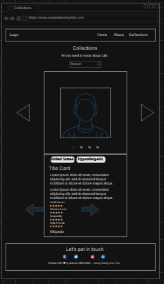

# MyLovelyPet

MyLovelyPet is a website dedicated to cat lovers and everyone interested in cats. The website features a variety of information about cats, including adorable pictures, descriptions, and ratings for different breeds of cats.

## Main Features

### Landing Page
The first page you will encounter when visiting the site is a landing page that features a carousel with adorable cat pictures. This is the perfect way to welcome users and showcase the site's appeal.

### About
The "About" page is where you can find out more about the creator of this website, myself. I will share brief information about myself and why I created MyLovelyPet.

### Collection
The "Collection" page is the core of this site. Here, you will find different categories of cats displayed in the form of a carousel. Each category has a favorability or rating which helps users to easily find their preferred cat breed. You can click on these categories to see more details about each cat breed.

## Technology Used
- Vue.js:A JavaScript framework used to build interactive website interfaces.
- Vuetify: A UI framework used to design attractive and responsive interfaces.

## Wireframe 

- Home 
- 
- About
- 
- Collections
- 

## Preview
- Home 
- 
- About
- 
- Collections
- 

## How to use

1. Make sure you have Node.js installed on your computer.
2. Clone this repository to your computer.
3. Open a terminal and navigate to the project directory.
4. Run the following command to install all dependencies:`npm install`
5. Run the project with the command: `npm run serve`
6. Open your browser and access `http://localhost:8080/` to view the MyLovelyPet website.

## Closing
Have fun surfing the MyLovelyPet website and discovering all kinds of adorable cats! If you have any questions or feedback, please feel free to contact me.

Thank you for visiting MyLovelyPet!